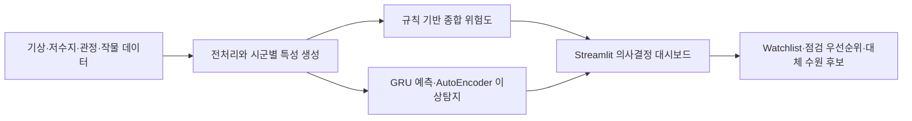
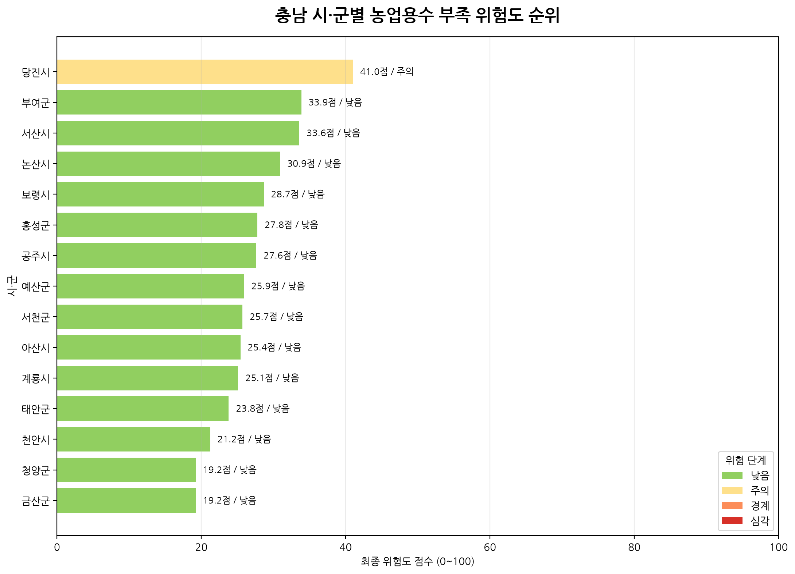

# AquaGuard AI

**충남 농업용수 부족 위험을 분석하고, 먼저 점검할 지역과 저수지를 찾는 데이터·AI 대시보드입니다.**

Python · Pandas · Streamlit · PyTorch · 공공데이터 분석

## 이봉헌의 기여

팀장 이봉헌 · 팀원 유재윤.

| 담당 작업 | 코드 변경 |
|---|---|
| 시군 선택 필터를 메인 대시보드와 하위 화면에 연결 | [변경 내용](https://github.com/kara320090/AquaGuard-AI/commit/87c14575838889b743126e0c8cc0f0cc90a1d79f) |
| 저수지명·주소·시군을 기준으로 Watchlist의 중복 시설 표시 정리 | [변경 내용](https://github.com/kara320090/AquaGuard-AI/commit/41c57fccce483366d0f20f602eb43dbc8081cbdb) |
| 대시보드의 위험 요인 설명과 시연 화면 개선 | [변경 내용](https://github.com/kara320090/AquaGuard-AI/commit/a76e0ed86874af90a109a74ccbd2323b7f101c0a) |

## 프로젝트 한눈에 보기

| 항목 | 내용 |
|---|---|
| 해결하려는 문제 | 강우량, 저수율, 관정, 작물 정보를 함께 살펴야 하는 농업용수 점검 의사결정 |
| 결과물 | 위험도 지도, 저수지 Watchlist, 대체 수원 후보, 점검 우선순위와 분석 보고서 |
| 구현 형태 | 사전에 생성한 분석 파일을 읽는 Streamlit 기반 해커톤 MVP |
| 팀 | 팀장 이봉헌 · 팀원 유재윤 |
| 관련 성과 | 제2회 올담 데이터 활용 해커톤 우수상 · 충남창조경제혁신센터 대표이사상 · 2026.06.09 |

아래 기능 설명은 팀이 구현한 프로젝트 결과물을 기준으로 합니다.



종합 위험도 산식과 Deep AI 모델 결과는 별도 분석 계층입니다. 추천 후보의 실제 급수 가능성은 현장 조건과 추가 자료로 확인해야 합니다.

### 결과물 살펴보기



그림은 저장소에 보관된 분석 결과이며, 현재 실시간 상황을 뜻하지 않습니다.

- [시연 시나리오](docs/DEMO_SCENARIO.md)
- [배포 가이드](docs/DEPLOYMENT_GUIDE.md) · [운영 안내](docs/OPERATIONS_RUNBOOK.md)
- [Live 데이터 처리 방식](docs/LIVE_DATA_METHOD.md)
- 핵심 코드: [최종 특성 생성](scripts/07_build_final_features.py), [검증](scripts/11_final_validation.py), [Deep AI 학습](scripts/13_train_deep_reservoir_ai.py)

### 빠른 시작

Python 3.11 환경에서 저장소 루트 기준으로 실행합니다.

```powershell
python -m venv .venv
.\.venv\Scripts\Activate.ps1
python -m pip install -r requirements.txt
streamlit run app.py
```

대시보드는 준비된 분석 파일을 사용합니다. 데이터를 재생성하려면 아래 실행 순서와 각 스크립트의 입력 파일을 확인하세요. Deep AI 학습 환경은 `requirements-ai.txt`도 사용합니다.
