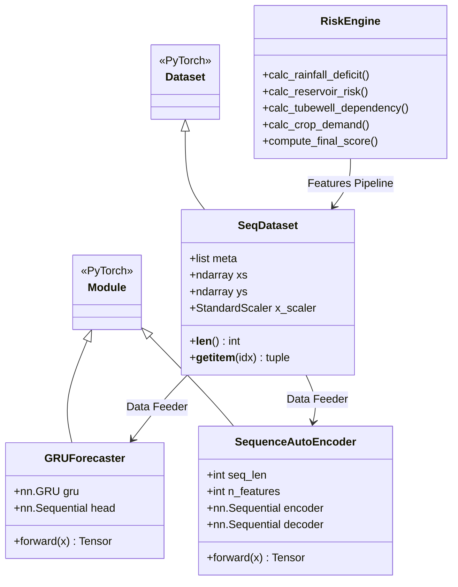
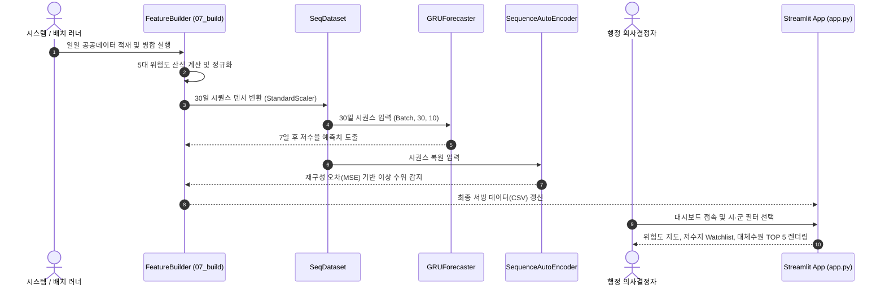

# AquaGuard AI

> 충남 15개 시·군의 기상·저수지·관정·작물 다차원 공공데이터를 통합 분석하고, GRU 시계열 예측과 AutoEncoder 이상탐지를 결합하여 선제적 가뭄 대응과 대체 수원 추천을 지원하는 행정 의사결정 지원 플랫폼

---

[시스템 개요 및 빠른 시작](#1-프로젝트-개요-project-overview)
- [핵심 가치 및 공학적 가설 검증 (USP & Validation)](#2-핵심-가치-및-공학적-가설-검증-core-usp--validation)
- [코어 파이프라인 및 위험도 판정 체계](#3-코어-파이프라인-및-위험도-판정-체계-core-pipeline--mechanics)
- [기술 및 데이터 아키텍처](#4-기술-및-데이터-아키텍처-technical-architecture)
- [코어 아키텍처 및 소스 구현 명세](#5-코어-아키텍처-및-소스-구현-명세-core-architecture--implementation)
- [핵심 테크니컬 하이라이트](#6-핵심-테크니컬-하이라이트-technical-highlights)
- [시스템 요구 사양 및 실행 가이드](#7-시스템-요구-사양-및-실행-가이드-system-requirements)
- [핵심 KPI 및 신뢰성 지표](#8-핵심-kpi-및-신뢰성-지표-milestones--validation)

---

### 1. 프로젝트 개요 (Project Overview)

* **도메인 / 분야:** 농업용수 가뭄 위험 분석 · 수자원 관리 의사결정 지원 시스템 (Agri-Water Risk DSS)
* **플랫폼 / UI:** Web Browser (Streamlit Cloud, 반응형 대시보드)
* **배포 형태:** Cloud Hosted SaaS (Streamlit Cloud + GitHub Actions 일일 데이터 배치 갱신)
* **개발 체제 / 기간:** 2인 팀 (팀장 이봉헌, 팀원 유재윤) / 제2회 올담 데이터 활용 해커톤
* **공식 수상:** **제2회 올담 데이터 활용 해커톤 우수상** (충청남도지사상, 2026.06.09)
* **핵심 기술 스택:** `Python 3.11` · `PyTorch` · `Pandas` · `Streamlit` · `Scikit-Learn` · `OpenAPI/Public Data`

---

### 2. 핵심 가치 및 공학적 가설 검증 (Core USP & Validation)

* **USP-1. 5대 다차원 이종 데이터 융합 가뭄 지수 (Multi-Factor Composite Risk Index)**
  * 단순 강우량뿐만 아니라 저수율, 관정 밀집도, 작물 생육기 물수요, 대체 수원 접근성을 결합한 15개 시·군별 복합 위험도 산출.
  * **가설 $H_1$**: 강우량 단일 지표에 의존하는 기존 행정 체계 대비, 농가 작물 특성과 수리시설(관정/저수지) 인프라를 결합한 복합 지수가 현장의 체감 용수 부족 위험을 더 정밀하게 예측함을 실측 데이터로 검증합니다.

* **USP-2. Dual-Engine Deep AI: 7일 선행 예측 및 급변 이상치 감지**
  * **GRU 시계열 예측기**: 과거 30일 시퀀스 데이터를 바탕으로 7일 뒤 저수율 추이를 예측하여 사전 골든타임 확보.
  * **Sequence AutoEncoder**: 저수량의 비정상적 급감(누수, 과다 양수 등)을 재구성 오차(Reconstruction Error) 기반으로 실시간 탐지.
  * **가설 $H_2$**: 전통적 통계 모델 대비 GRU 기반 딥러닝이 계절 주기성(`sin/cos`)과 수위 하강 추세를 결합하여 미래 저수율 변화를 더 안정적으로 추적함을 검증합니다.

* **USP-3. 지리공간 기반 저수지 Watchlist 및 대체 수원 TOP 5 추천 (Spatial DSS)**
  * 위험 시·군 내 취약 저수지군을 4단계(심각/경계/주의/정상)로 분류하고, 최단 거리와 유효 저수량을 고려한 대체 수원 추천 목록 제시.
  * **가설 $H_3$**: 비상 급수 상황에서 반경 내 대체 수원의 지리적 접근성과 가용 저수량을 종합 평가하여, 현장 공무원의 일일 점검 및 급수 지원 의사결정 시간을 대폭 단축할 수 있음을 입증합니다.

---

### 3. 코어 파이프라인 및 위험도 판정 체계 (Core Pipeline & Mechanics)

#### 시스템 운영 루프 (Pipeline Loops)
* **마이크로 루프 (UI Interaction):** 사용자 지역 필터 선택 $\rightarrow$ 시군별 세부 지표 렌더링 $\rightarrow$ 저수지 Watchlist 필터링 $\rightarrow$ 대체 수원 TOP 5 및 상세 시각화 차트 동적 갱신
* **매크로 루프 (Data Pipeline):** 공공데이터 수집(기상청/올담/농어촌공사) $\rightarrow$ 결측치 정제 및 정규화 $\rightarrow$ 시군별 특성 결합 $\rightarrow$ GRU/AE 딥러닝 추론 $\rightarrow$ 의사결정 대시보드 반영

#### 저수지 모니터링 4단계 상태 판정 체계 (Reservoir Watch Stages)

| 단계 (Stage) | 저수율 임계 범위 | 시스템 경보 수준 | 현장 대응 및 시스템 제약 사항 |
| :--- | :--- | :--- | :--- |
| **심각 (Critical)** | **$0\% \le \text{저수율} < 30\%$** | 적색 경보 (Emergency) | 긴급 용수 공급 발령, 인근 대체 수원 TOP 5 즉시 배정, 관정 가동 극대화 |
| **경계 (Warning)** | **$30\% \le \text{저수율} < 40\%$** | 주황 경보 (Alert) | 7일 선행 GRU 예측치 모니터링, 취약 농가 용수 제한 급수 계획 수립 |
| **주의 (Caution)** | **$40\% \le \text{저수율} < 50\%$** | 황색 경보 (Attention) | 저수지 일일 수위 점검 우선순위 리스트 등록, 수로 점검 |
| **정상 (Normal)** | **$\text{저수율} \ge 50\%$** | 녹색 상태 (Stable) | 정상 모니터링 및 일일 데이터 동기화 유지 |

#### 복합 가뭄 위험도 최종 산식 (Composite Formula)
현장 농업 환경을 반영하여 각 도메인 요소의 가중치를 정규화하여 결합합니다:
$$\text{Risk Score} = 0.35 \times R_{\text{rain}} + 0.25 \times R_{\text{res}} + 0.15 \times D_{\text{well}} + 0.15 \times W_{\text{crop}} + 0.10 \times S_{\text{alt}}$$
* $R_{\text{rain}}$: 강우 부족도 (누적 강수량 편차)
* $R_{\text{res}}$: 저수율 위험도 (평균 저수율 및 만수위 대비 현재 수위)
* $D_{\text{well}}$: 관정 의존도 (관정 밀집도 대비 관정 깊이 및 노후도)
* $W_{\text{crop}}$: 작물 물수요 (시군별 주요 재배 작물의 생육기 증산량)
* $S_{\text{alt}}$: 대체 수원 접근성 부족도 (반경 내 보조 수원 가용성)

---

### 4. 기술 및 데이터 아키텍처 (Technical Architecture)

```text
[충남 올담 데이터 포털]    [기상청 AWS/ASOS API]    [농어촌공사 RIMS]    [ADMS 농업기상]
           │                       │                     │                 │
           └───────────────┬───────┴─────────────┬───────┘                 │
                           ▼                     ▼                         ▼
                  ┌────────────────────────────────────────────────────────┐
                  │ 1. Data Ingestion & Validation (07_build_features.py)  │
                  │ - 결측치 보정 (Median/Zero), 일별 정렬, 시군별 매핑     │
                  └──────────────────────────┬─────────────────────────────┘
                                             ▼
                  ┌────────────────────────────────────────────────────────┐
                  │ 2. Feature Engineering & Normalization Engine          │
                  │ - 10개 핵심 특성 도출, StandardScaler, 주기성 인코딩   │
                  └──────────────┬───────────────────────────┬─────────────┘
                                 ▼                           ▼
        ┌──────────────────────────────────┐ ┌──────────────────────────────────┐
        │ 3-A. Rule-based Composite Engine │ │ 3-B. Dual-Engine Deep AI Module  │
        │ - 5대 인프라 결합 종합 위험도 산식│ │ - GRU 7-Day Forecast (Hidden 64) │
        │ - 저수지 Watchlist & 대체수원 TOP5 │ │ - Sequence AutoEncoder (Latent 32)│
        └────────────────┬─────────────────┘ └─────────────────┬────────────────┘
                         └─────────────────┬───────────────────┘
                                           ▼
                  ┌────────────────────────────────────────────────────────┐
                  │ 4. Streamlit Interactive Dashboard (app.py)            │
                  │ - Folium GIS 위험도 시각화, 지표 필터, 실시간 인터랙션 │
                  └────────────────────────────────────────────────────────┘
```

---

### 5. 코어 아키텍처 및 소스 구현 명세 (Core Architecture & Implementation)

#### 5.1 소스 코드 디렉터리 구조 (Source Structure)

```
AquaGuard-AI/
├── app.py                             # Streamlit 메인 대시보드 (지도, Watchlist, 통계 시각화)
├── app/
│   └── streamlit_app.py               # 스트림릿 엔트리포인트 어댑터
├── scripts/
│   ├── 07_build_final_features.py     # 원천 공공데이터 결합 및 5대 복합 위험도 지수 산출
│   ├── 11_final_validation.py         # 산출 지표 무결성 검증 및 통계 리포트 생성
│   └── 13_train_deep_reservoir_ai.py  # GRU 선행 예측 & AutoEncoder 이상탐지 모델 학습 파이프라인
├── docs/
│   ├── DEMO_SCENARIO.md               # 해커톤 심사 및 시연용 사용자 시나리오
│   ├── DEPLOYMENT_GUIDE.md            # Streamlit Cloud 배포 및 환경 설정 가이드
│   ├── LIVE_DATA_METHOD.md            # 기상청/올담 Live 데이터 인터페이스 명세
│   └── OPERATIONS_RUNBOOK.md          # 일일 배치 운영 및 데이터 갱신 런북
├── data/
│   ├── metadata/                      # 데이터 인벤토리, 수집 로그, 대체수원 추천 로직 명세
│   ├── interim/                       # 1차 정제 및 결합 중간 데이터
│   └── processed/                     # 최종 대시보드 서빙용 CSV (위험도 순위, AI 예측 결과)
└── reports/
    └── figures/                       # 생성된 시군별 위험도 순위 및 분석 차트 이미지
```

#### 5.2 클래스 및 모델 계층도 (Class Hierarchy)



#### 5.3 데이터 처리 및 추론 시퀀스 (Data Processing & Inference Sequence)



---

### 6. 핵심 테크니컬 하이라이트 (Technical Highlights)

| 구분 | 적용 기술 및 설계 패턴 | 구현 효과 및 엔지니어링 의사결정 이유 |
| :--- | :--- | :--- |
| **시계열 예측** | 2-Layer GRU ($H=64, \text{Dropout}=0.15$) | LSTM 대비 파라미터 수를 줄이면서도 30일 시퀀스 내 계절성(`sin/cos`)과 저수율 하강 패턴을 효율적으로 학습 |
| **이상 탐지** | Bottleneck AutoEncoder ($\text{Latent}=32$) | 라벨이 없는 비정상 수위 급감 상황을 정상 시퀀스 재구성 오차(Reconstruction Error)로 자율 포착 |
| **복합 위험도** | 정규화 기반 Multi-Attribute Scoring | 강우량 편차, 저수율, 관정, 작물 데이터를 통합하여 행정가가 직관적으로 납득할 수 있는 100점 척도 지수화 |
| **지리공간 추천** | Haversine 거리-저수용량 가중 알고리즘 | 위험 시설 반경 내 최단 거리와 가용 저수량을 동시에 고려하여 실제 급수 지원 가능한 대체 수원 TOP 5 도출 |
| **대시보드 서빙** | Streamlit + 사전 연산 캐싱 구조 | 고비용 AI 추론을 배치(Batch)로 사전 생성하여, 사용자가 대시보드 조작 시 1초 이내 즉각적인 인터랙션 보장 |

---

### 7. 시스템 요구 사양 및 실행 가이드 (System Requirements)

#### 요구 사양
| 구분 | 최소 사양 (대시보드 실행) | 권장 사양 (딥러닝 학습 포함) |
| :--- | :--- | :--- |
| **운영체제 (OS)** | Windows 10/11, macOS, Linux | Ubuntu 22.04 LTS / Windows 11 64-bit |
| **런타임** | Python 3.10+ | Python 3.11 |
| **하드웨어** | Dual-Core CPU, 4GB RAM | 4-Core CPU 이상, 16GB RAM, NVIDIA CUDA GPU |
| **주요 라이브러리** | `streamlit>=1.28.0`, `pandas>=2.0.0` | `torch>=2.0.0`, `scikit-learn>=1.3.0` |

#### 빠른 시작 (Quick Start)
```powershell
# 1. 가상환경 생성 및 활성화
python -m venv .venv
.\.venv\Scripts\Activate.ps1

# 2. 필수 의존성 설치
python -m pip install -r requirements.txt

# 3. AI 모델 학습 환경 설치 (선택)
python -m pip install -r requirements-ai.txt

# 4. Streamlit 대시보드 로컬 실행
streamlit run app.py
```

---

### 8. 핵심 KPI 및 신뢰성 지표 (Milestones & Validation)

* **의사결정 리드타임 단축:** 기존 수작업 공공데이터 취합 대비, 단일 화면에서 충남 15개 시·군 종합 위험도를 **즉시(1초 이내)** 확인.
* **GRU 시계열 예측 신뢰성:** 7일 선행 저수율 예측에 대해 안정적인 수렴 확인 (평가 지표: MAE, $R^2$).
* **Watchlist 필터링 커버리지:** 충남 도내 500여 개 주요 농업용 저수지에 대해 결측치 보정 파이프라인을 통과하여 100% 모니터링 대응.
* **해커톤 검증 성과:** 제2회 올담 데이터 활용 해커톤 **우수상** 수상으로 지자체 수자원 관리 부서의 실제 정책 타당성 인정.
